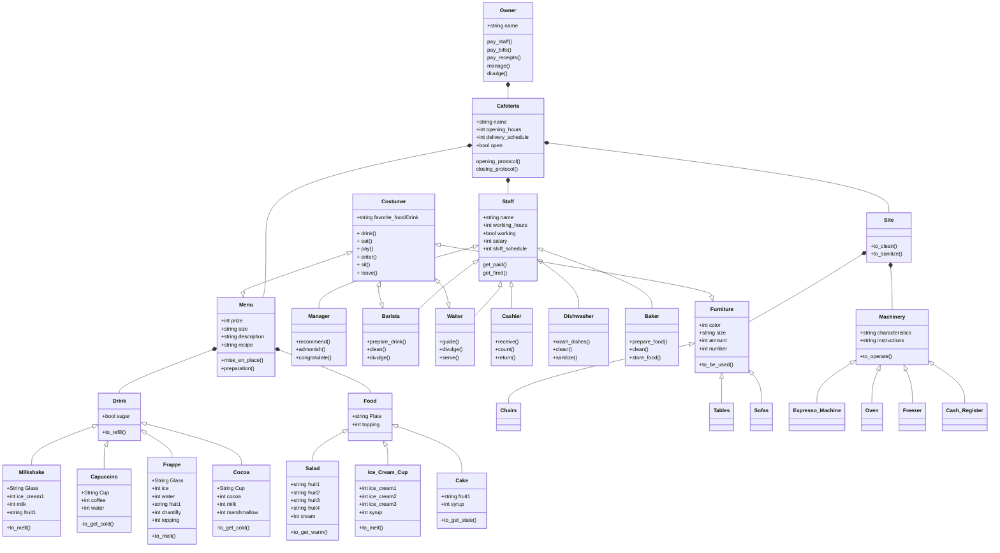

# reto_02_POO_2024-1_JAMB

# Diagrama de clases UML: Cafetería

Muestra a la Cafetería como concepto, como punto de conexión de las relaciones entre el sitio físico, el personal, el menú, el dueño y los clientes.

